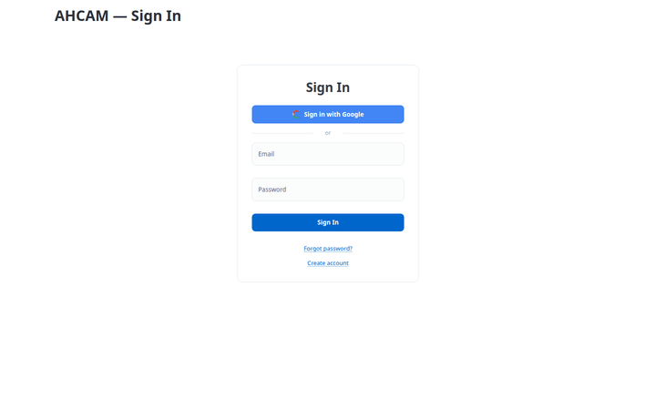

# Ashland Hill Collection Account Management

AI-powered collection account management platform for film & entertainment finance — waterfall recoupment, immutable transaction ledger, automated disbursements, AI contract parsing, revenue forecasting, and anomaly detection.



## Features

**Core CAM** — 6 modules covering the full collection account lifecycle:
- **Productions** — Film/TV project registry with budget, status, and personnel tracking
- **Stakeholders** — All parties: producers, financiers, distributors, sales agents, guilds, talent
- **Collection Accounts** — Segregated accounts per production with balance tracking
- **Waterfall Engine** — Priority-based recoupment rules (percentage, fixed, corridor, residual) with caps and cross-collateralization
- **Transactions** — Immutable SHA-256 hash-chained ledger for all inflows and outflows
- **Disbursements** — Automated payout processing based on waterfall rules with approval workflows

**AI Tools** — 4 intelligent modules powered by XAI Grok:
- **Contract Parser** — Upload CAMA/distribution agreements, AI extracts waterfall rules, parties, and key terms
- **Reports** — Collection account statements, waterfall position reports, stakeholder-specific views
- **Revenue Forecasting** — AI-predicted future sales by territory, source, and quarter
- **Anomaly Detection** — Flags unusual amounts, timing irregularities, duplicate transactions, rule violations

**AI Chat** — 15 tools accessible via natural language or structured commands:
```
production:list           account:list             waterfall:list
waterfall:run PROD_ID     transaction:list         disbursement:list
disbursement:run PROD_ID  stakeholder:search NAME  contract:upload
report:PROD_ID            forecast:PROD_ID         anomaly:scan
help
```

## Quick Start

```bash
# Clone
git clone https://github.com/kaljuvee/ahcam.git
cd ahcam

# Setup
python -m venv .venv
source .venv/bin/activate
pip install -r requirements.txt

# Configure
cp .env.sample .env
# Edit .env with your API keys (see below)

# Run database migrations
for f in sql/*.sql; do psql $DB_URL -f "$f"; done

# Load seed data (15 productions, 20 stakeholders, 33 transactions)
python data/load_seed_data.py

# Start
python app.py
# Open http://localhost:5011
```

### Docker

```bash
docker compose up --build
# Open http://localhost:5011
```

## Environment Variables

Copy `.env.sample` to `.env` and fill in:

| Variable | Description |
|----------|-------------|
| `DB_URL` | PostgreSQL connection string |
| `XAI_API_KEY` | XAI Grok LLM API key |
| `JWT_SECRET` | Random string for JWT signing |
| `ENCRYPTION_KEY` | Fernet key for bank detail encryption |

```bash
# Generate encryption key
python -c "from cryptography.fernet import Fernet; print(Fernet.generate_key().decode())"
```

## Demo Credentials

After running `python data/load_seed_data.py`:

```
Email:    demo@ashlandhill.com
Password: demo1234
```

## Tech Stack

| Component | Technology |
|-----------|-----------|
| Frontend | FastHTML + HTMX (server-rendered, 3-pane layout) |
| AI Engine | LangGraph + XAI Grok-3 (15 tools) |
| Database | PostgreSQL (14 tables, `ahcam` schema) |
| Ledger | SHA-256 hash-chained immutable transactions |
| Waterfall | Pandas-powered recoupment engine |
| Auth | Email/password + bcrypt + JWT sessions |
| Deployment | Docker + docker-compose |

## Testing

```bash
# Run test suite
python tests/test_suite.py

# Capture user guide screenshots
python tests/capture_guide.py

# Generate demo video and GIF
python tests/capture_video.py
```

## Seed Data

The `data/` directory contains CSV files with realistic film finance data:

| File | Records | Description |
|------|---------|-------------|
| `productions.csv` | 15 | Feature films, docs, series across all statuses |
| `stakeholders.csv` | 20 | Distributors, financiers, producers, guilds, talent |
| `collection_accounts.csv` | 15 | One per production, $22.8M total balance |
| `waterfall_rules.csv` | 26 | 6 productions with full waterfall chains |
| `transactions.csv` | 33 | Distributor inflows, hash-chained |
| `production_stakeholders.csv` | 27 | Cross-references linking parties to productions |

## Architecture

3-pane layout following the AHMF pattern:
- **Left sidebar** (260px) — Navigation, chat commands, conversation history
- **Center pane** — AI chat (WebSocket streaming) + HTMX module views
- **Right pane** (380px, toggled) — AI trace inspector with tool execution details

```
ahcam/
├── app.py                 # Main FastHTML app (layout, auth, agent, routes)
├── config/settings.py     # Constants (statuses, roles, rule types)
├── modules/               # 10 product modules
│   ├── productions.py     # Production CRUD
│   ├── stakeholders.py    # Stakeholder management
│   ├── collections.py     # Collection account management
│   ├── waterfall.py       # Waterfall engine (Pandas)
│   ├── transactions.py    # Immutable ledger
│   ├── disbursements.py   # Payout processing
│   ├── contracts.py       # AI contract parser
│   ├── reports.py         # Collection reports
│   ├── forecasting.py     # Revenue forecasting
│   └── anomaly.py         # Anomaly detection
├── utils/
│   ├── db.py              # SQLAlchemy connection pool
│   ├── auth.py            # bcrypt + JWT auth
│   ├── ledger.py          # SHA-256 hash chain
│   └── agui/              # WebSocket chat engine
├── sql/                   # 12 database migrations
├── data/                  # Seed data CSVs + loader
├── tests/                 # Test suite + Playwright captures
└── docs/                  # Demo video, frames
```

## License

Private & Confidential — Ashland Hill Media Finance
