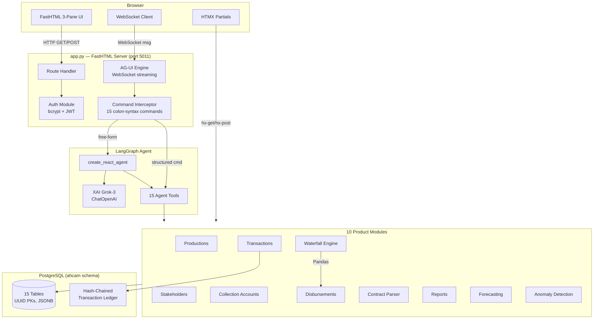
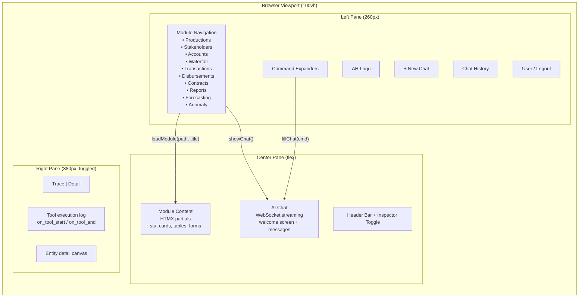
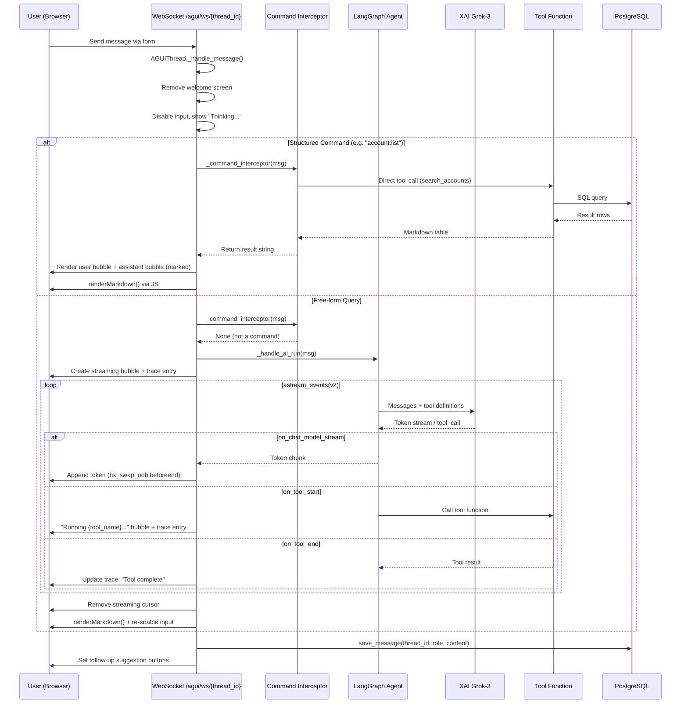
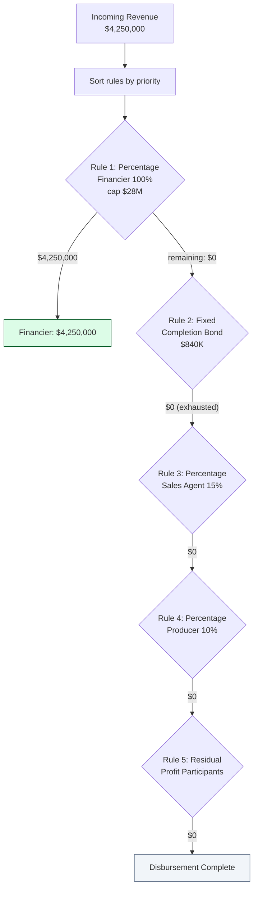
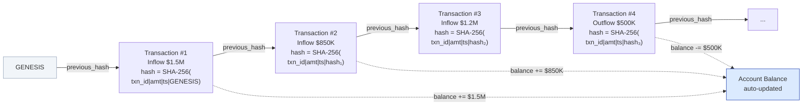
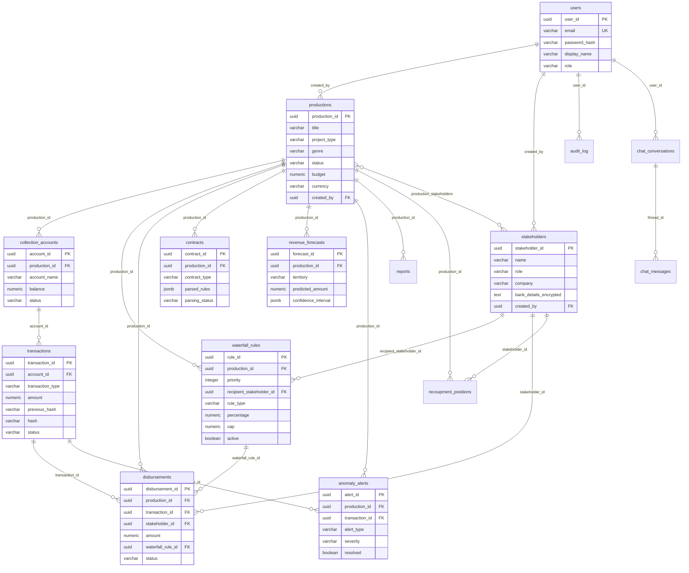
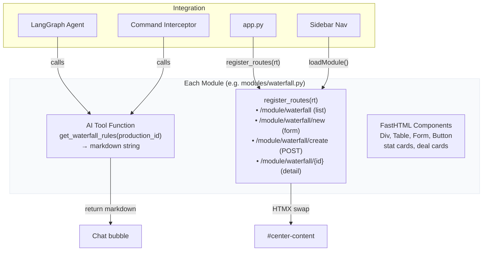
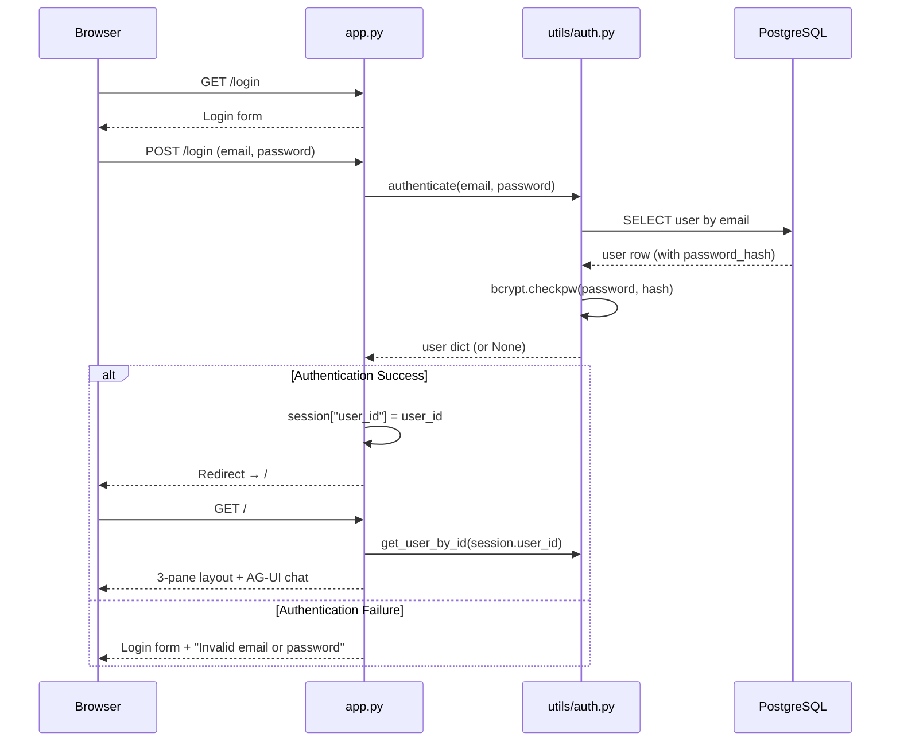
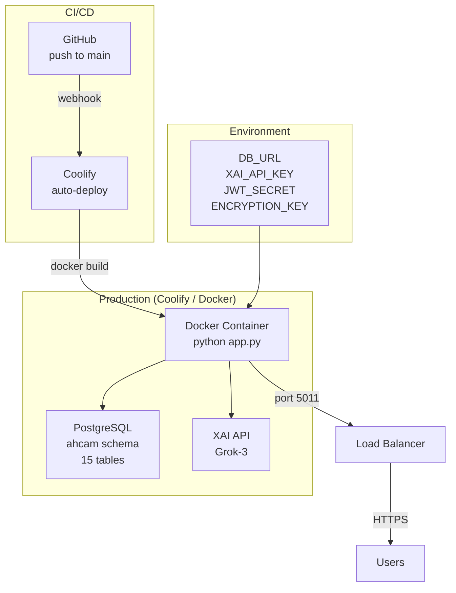

# AHCAM Architecture

## System Overview



## 3-Pane Layout



## Chat Message Flow



## Agent Tool Architecture

```mermaid
graph TD
    subgraph Agent["LangGraph React Agent"]
        LLM["XAI Grok-3-mini<br/>streaming=True"]
    end

    subgraph CoreTools["Core CAM Tools"]
        T1["search_productions<br/>query → markdown table"]
        T2["get_production_detail<br/>production_id → detail view"]
        T3["search_stakeholders<br/>query → markdown table"]
        T4["search_accounts<br/>query → markdown table"]
        T5["get_account_balance<br/>account_id → balance detail"]
        T6["get_waterfall_rules<br/>production_id → rules table"]
        T7["run_waterfall<br/>production_id → payout breakdown"]
        T8["search_transactions<br/>query → ledger table"]
        T9["get_disbursement_status<br/>query → disbursement table"]
        T10["run_disbursements<br/>production_id → process payouts"]
    end

    subgraph AITools["AI-Powered Tools"]
        T11["parse_contract_tool<br/>text → parties, rules, terms"]
        T12["generate_report<br/>production_id → collection statement"]
        T13["get_recoupment_position<br/>stakeholder → position across productions"]
        T14["generate_forecast<br/>production_id → 12-month projection"]
        T15["run_anomaly_scan<br/>query → anomaly report"]
    end

    Agent --> CoreTools
    Agent --> AITools

    T7 -->|"Pandas DataFrame"| WF["apply_waterfall()"]
    T10 -->|"waterfall + ledger"| WF
    T10 -->|"record_transaction()"| Ledger["Hash-Chained Ledger"]
    T8 --> Ledger
    T11 -->|"LLM call"| LLM2["Grok-3 (separate)"]
    T14 -->|"LLM call"| LLM2
```



## Waterfall Engine Flow



## Transaction Ledger Hash Chain



## Database Schema



## Module Architecture Pattern



## Authentication Flow



## Deployment



## File Structure

```
ahcam/
├── app.py                      # Main entry: layout, auth, agent, routes (~750 lines)
├── config/
│   └── settings.py             # Constants: statuses, roles, rule types, territories
├── modules/                    # 10 product modules (tool + routes + UI each)
│   ├── productions.py          # Production CRUD
│   ├── stakeholders.py         # Stakeholder management
│   ├── collections.py          # Collection account management
│   ├── waterfall.py            # Waterfall engine (Pandas) + rule builder
│   ├── transactions.py         # Immutable ledger UI
│   ├── disbursements.py        # Payout processing
│   ├── contracts.py            # AI contract parser (Grok LLM)
│   ├── reports.py              # Collection statements + recoupment positions
│   ├── forecasting.py          # AI revenue forecasting (Grok LLM)
│   └── anomaly.py              # Transaction anomaly detection
├── utils/
│   ├── db.py                   # SQLAlchemy singleton pool
│   ├── auth.py                 # bcrypt + JWT (7-day expiry)
│   ├── ledger.py               # SHA-256 hash chain + verify_chain()
│   └── agui/                   # WebSocket chat engine
│       ├── core.py             # AGUIThread, UI, streaming, command routing
│       ├── chat_store.py       # Chat persistence (PostgreSQL)
│       └── styles.py           # Chat CSS (light theme)
├── sql/                        # 12 migrations (01–12)
├── data/                       # 6 CSVs + load_seed_data.py
├── tests/
│   ├── test_suite.py           # Unit tests (DB, auth, waterfall, ledger, config)
│   ├── capture_guide.py        # Playwright screenshot capture
│   └── capture_video.py        # Playwright video/GIF generation
├── docs/
│   ├── business_overview.md    # Business logic and data model
│   ├── architecture_readme.md  # This file (Mermaid diagrams)
│   ├── demo_video.mp4          # 39-second product demo
│   └── demo_video.gif          # Animated demo for README
├── static/guide/               # 13 module screenshots
├── Dockerfile                  # Python 3.13-slim, port 5011
├── docker-compose.yml          # Single-service deployment
├── requirements.txt            # 14 dependencies
├── .env.sample                 # Template for environment variables
├── CLAUDE.md                   # AI assistant project context
└── README.md                   # Project readme with demo GIF
```
